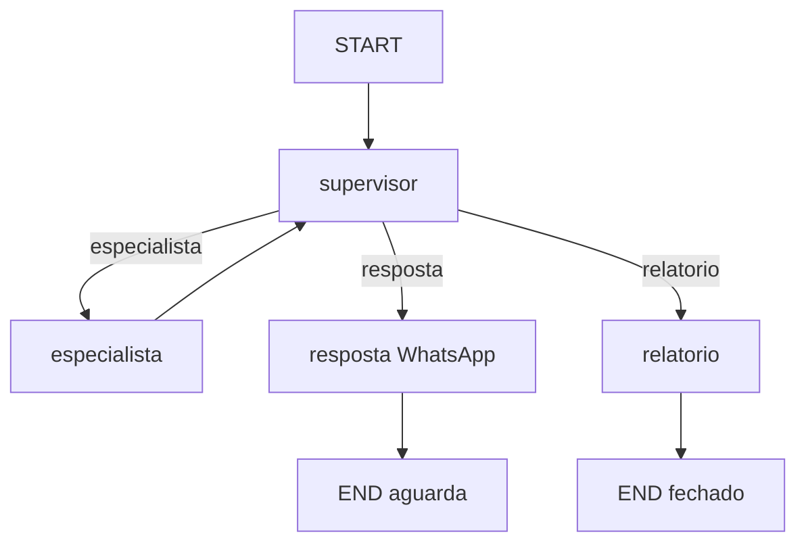

# LAB 002 • Triagem Inteligente de Suporte

> Segunda iniciativa do Laboratório de IA Aplicada do Grupo de Estudos da Pós-Graduação UNIPDS.

---

# 📖 Contexto

Enquanto o LAB 001 explorou um agente único (grafo com um nó), o LAB 002 aprofunda o estudo de **orquestração multi-agente**: um supervisor classifica o ticket e roteia para subagentes especialistas.

A empresa fictícia do laboratório continua sendo a **LevelUp Games** — e-commerce de games (consoles, jogos e acessórios).

Este documento é a base do desafio e deve evoluir com o grupo.

---

# 🎯 Problema

Filas de suporte misturam cobrança, problemas técnicos e dúvidas comerciais no mesmo canal.

Triagem manual atrasa o atendimento, desgasta especialistas com tickets fora da alçada e gera erros de especialização (ex.: reembolso tratado como “dúvida de produto”).

---

# 💡 Objetivo

Construir um pipeline de agentes capaz de:

1. **Classificar** o ticket (cobrança, técnico ou comercial).
2. **Rotear** para um subagente especialista.
3. **Analisar** com persona e regras da área.
4. **Gerar** um relatório em Markdown com diagnóstico, prioridade e resposta sugerida.

O MVP processa tickets offline a partir de arquivos seed **e** aceita mensagens reais via **Evolution API** (WhatsApp).

---

# 🔄 Fluxo

## Batch (seeds)

```text
Ticket
   │
   ▼
Supervisor  ◄─────────────────────────────┐
   │ decide proximo / pronto              │
   ├── especialista_* ────────────────────┘  (volta pro loop)
   └── relatorio → END
```

## WhatsApp (Evolution API)

```text
WhatsApp → Evolution API → POST /webhook
   │
   ▼
Sessão do chamado (por remoteJid)
   │
   ▼
Supervisor  ◄─────────────────────────────┐
   │                                     │
   ├── especialista_* ───────────────────┘
   ├── resposta → sendText → END (aguarda próxima msg)
   └── relatorio → sendText encerramento → Markdown interno → END
```



---

# 🤖 Papel de cada agente

| Agente | Responsabilidade |
|--------|------------------|
| **Supervisor** | Em **loop**: decide `proximo` (especialista, `resposta` ou `relatorio`) e `pronto`. Pode enviar mensagem ao cliente ou encerrar o chamado. Anti-loop com `SUPERVISOR_MAX_HOPS` (padrão 5). |
| **Especialista Cobrança** | Reembolsos, cobrança duplicada, estorno, fatura, meios de pagamento. |
| **Especialista Técnico** | Defeitos, garantia, instalação, download, problemas de hardware/software. |
| **Especialista Comercial** | Disponibilidade, pré-venda, frete, prazos, dúvidas de compra. |
| **Resposta** | Envia `mensagem_cliente` via WhatsApp sem encerrar o chamado. |
| **Relatório** | Encerra o chamado no WhatsApp, formata análises + trilha de hops e grava Markdown interno para o operador humano. |

Após cada especialista, o fluxo **volta ao supervisor**, que reavalia handoffs e escolhe o próximo passo até `pronto: true` ou o limite de hops.

---

# 🧰 Stack

| Peça | Uso no MVP |
|------|------------|
| Node.js + TypeScript (ESM) | Runtime e tipagem |
| LangGraph | Grafo multi-agente + conditional edges |
| LangChain OpenRouter | LLM via OpenRouter |
| Prompts em Markdown | Um arquivo por agente em `app/src/agents/` |
| Seeds `.txt` | Tickets sintéticos em `app/seed/` |

---

# 🎓 Objetivos de aprendizagem

1. Padrão **supervisor–worker** em LangGraph.
2. **Estado compartilhado** entre nós e `addConditionalEdges`.
3. **Um prompt por agente** (persona + escopo + schema de saída).
4. Separar **roteamento** de **especialização**.
5. Batch offline + documentação como artefato do laboratório.

---

# ▶️ Como executar

```bash
cd desafios/triagem-de-suporte/app
cp .env.example .env   # preencher OPENROUTER_API_KEY
pnpm i                 # ou npm i
pnpm start             # ou npm start
```

Saída esperada: `app/output/triagem.md`.

## Webhook Evolution (WhatsApp)

1. Configure no `.env`:

```bash
EVOLUTION_API_URL=https://evolution.localhost
EVOLUTION_API_KEY=sua-api-key
EVOLUTION_INSTANCE=nome-da-instancia
EVOLUTION_TLS_INSECURE=true   # dev com cert local
WEBHOOK_PORT=3000
```

2. Suba o servidor:

```bash
npm run webhook
```

3. Na instância Evolution, aponte o webhook para:
   - **Mesma máquina:** `http://127.0.0.1:3000/webhook`
   - **Evolution em Docker:** `http://host.docker.internal:3000/webhook`

4. Eventos necessários: **`MESSAGES_UPSERT`** (não use `CHATS_UPSERT` — esse evento não traz mensagens de texto para o fluxo).

5. Saídas em runtime:
   - `output/sessions/` — sessões abertas/fechadas por contato
   - `output/chamados/{ticketId}.md` — relatório interno ao encerrar

O supervisor decide entre **`resposta`** (mensagem ao cliente, chamado continua aberto) e **`relatorio`** (mensagem de encerramento + relatório para análise humana).

### Logs e troubleshooting

Defina `LOG_LEVEL=debug` no `.env` para ver cada requisição HTTP e o payload resumido da Evolution.

Ao subir, o servidor imprime logs estruturados com escopos: `server`, `http`, `webhook`, `sessao`, `graph`, `resposta`, `relatorio`.

**Sintoma:** mensagem chega no WhatsApp/Evolution, mas nada aparece no terminal.

1. Confirme que `npm run webhook` está rodando e ouvindo na porta `3000`.
2. Verifique o evento na Evolution: deve ser `MESSAGES_UPSERT`.
3. Consulte a config atual:

```bash
curl -sk -H "apikey: SUA_KEY" \
  "https://evolution.localhost/webhook/find/Global%20Whats"
```

4. Se estiver com `CHATS_UPSERT`, corrija:

```bash
curl -sk -X POST "https://evolution.localhost/webhook/set/Global%20Whats" \
  -H "apikey: SUA_KEY" \
  -H "Content-Type: application/json" \
  -d '{"webhook":{"enabled":true,"url":"http://host.docker.internal:3000/webhook","webhookByEvents":false,"webhookBase64":false,"events":["MESSAGES_UPSERT"]}}'
```

5. Reinicie `npm run webhook` após mudanças no código.

## LangSmith Studio (visualização + debug)

1. Crie conta em [LangSmith](https://smith.langchain.com) e gere uma API key em **Settings → API Keys**.
2. No `.env`, preencha:

```bash
LANGSMITH_API_KEY=lsv2_pt_...
LANGCHAIN_TRACING_V2=true
LANGCHAIN_PROJECT=triagem-de-suporte
```

3. Instale deps e suba o Agent Server local:

```bash
npm i
npm run studio
```

4. Abra o link do Studio impresso no terminal (em geral algo como `https://smith.langchain.com/studio/?baseUrl=http://127.0.0.1:2024`).
5. Selecione o grafo **`triagem`**. No input, use o schema do state (não é chat livre). Exemplo em [`app/studio-input.example.json`](./app/studio-input.example.json).

> **Nota:** o Studio extrai o schema do grafo via TypeScript. Este projeto usa **TypeScript 5.x** (`~5.8.3`). TypeScript 7 remove os `.d.ts` em `lib/` e quebra a extração (`Failed to extract schema` / TSVFS).
>
> Se o terminal mostrar `No projects found to resolve tenant`, a `LANGSMITH_API_KEY` está ausente/inválida ou sem workspace — regere em [Settings](https://smith.langchain.com/settings) e reinicie o Studio.

Variáveis de ambiente:

| Variável | Descrição |
|----------|-----------|
| `OPENROUTER_API_KEY` | Chave da API OpenRouter (obrigatória) |
| `OPENROUTER_MODEL` | Fallback global (padrão: `openai/gpt-4o-mini`) |
| `OPENROUTER_MODEL_SUPERVISOR` | Modelo do supervisor (opcional) |
| `OPENROUTER_MODEL_COBRANCA` | Modelo do especialista de cobrança (opcional) |
| `OPENROUTER_MODEL_TECNICO` | Modelo do especialista técnico (opcional) |
| `OPENROUTER_MODEL_COMERCIAL` | Modelo do especialista comercial (opcional) |
| `LANGSMITH_API_KEY` | Chave LangSmith (obrigatória para Studio) |
| `LANGCHAIN_TRACING_V2` | `true` para enviar traços |
| `LANGCHAIN_PROJECT` | Nome do projeto no LangSmith |
| `EVOLUTION_API_URL` | Base da Evolution API (padrão: `https://evolution.localhost`) |
| `EVOLUTION_API_KEY` | API key da instância Evolution |
| `EVOLUTION_INSTANCE` | Nome da instância WhatsApp |
| `EVOLUTION_TLS_INSECURE` | `true` para aceitar certificado HTTPS local em dev |
| `WEBHOOK_PORT` | Porta do servidor webhook (padrão: `3000`) |

Se a variável de modelo por agente não estiver definida, usa-se `OPENROUTER_MODEL`.

---

# 📁 Estrutura

```
triagem-de-suporte/
├── README.md
├── REQUISITOS.md
└── app/
    ├── package.json
    ├── langgraph.json     # config LangGraph CLI / Studio
    ├── studio-input.example.json
    ├── tsconfig.json
    ├── .env.example
    ├── README.md          # regras de seeds
    ├── seed/              # tickets sintéticos
    ├── output/            # gerado em runtime (triagem, sessions, chamados)
    └── src/
        ├── index.ts       # batch seeds
        ├── server.ts      # webhook Evolution
        ├── evolution.ts   # cliente sendText
        ├── session.ts     # sessões multi-turno
        ├── config.ts
        ├── state.ts
        ├── graph.ts       # exporta `graph` para o Studio
        ├── nodes/
        │   ├── supervisor.ts
        │   ├── especialista.ts
        │   ├── resposta.ts
        │   └── relatorio.ts
        └── agents/
            ├── supervisor.md
            ├── especialista-cobranca.md
            ├── especialista-tecnico.md
            └── especialista-comercial.md
```

---

# 🔮 Fora do escopo (ainda)

- Tools web ou RAG
- Handoff humano operacional além do relatório
- UI / dashboard
- Testes E2E dependentes de LLM real

Veja [REQUISITOS.md](./REQUISITOS.md) para RF/RNF detalhados.

---

# 🔗 Relação com o LAB 001

| LAB 001 | LAB 002 |
|---------|---------|
| Avalia qualidade de atendimentos encerrados | Triagem de tickets antes/durante o suporte |
| Um agente, um nó no grafo | Supervisor + 3 subagentes + relatório |
| Saída HTML consolidada | Saída Markdown por ticket (batch) |
