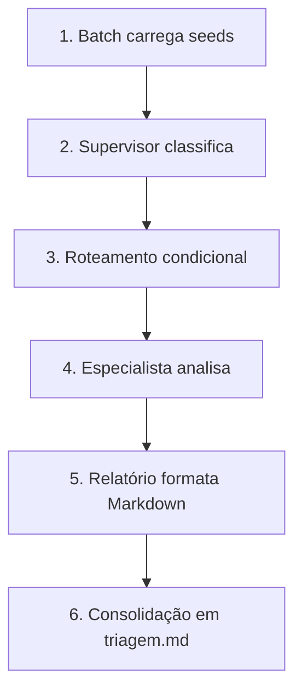

# Levantamento de Requisitos

## LAB 002 • Triagem Inteligente de Suporte

> **Status:** MVP especificado
>
> Documento base para discussão, implementação e evolução do backlog do LAB 002.

---

# 📖 Objetivo

Construir um sistema multi-agente que classifique tickets de suporte da LevelUp Games, roteie cada um a um especialista (cobrança, técnico ou comercial) e produza análise acionável em relatório Markdown.

Objetivo de aprendizagem: orquestração supervisor–worker com LangGraph, estado compartilhado e prompts externos por agente.

---

# 👥 Atores

- **Cliente** — envia o ticket (neste MVP: texto seed).
- **Fila de suporte** — conjunto de tickets pendentes de triagem.
- **Supervisor IA** — classifica a categoria do ticket.
- **Especialista IA (cobrança / técnico / comercial)** — analisa e sugere resposta/ação.
- **Gestor / operador** — consome o relatório Markdown.

---

# 🔄 Fluxo do MVP

1. Processo batch carrega tickets de `seed/*.txt`.
2. Para cada ticket, o Supervisor classifica a categoria.
3. Grafo roteia para o especialista correspondente.
4. Especialista devolve análise estruturada (JSON no prompt).
5. Nó de relatório formata o resultado em Markdown.
6. Resultados de todos os tickets são consolidados em `output/triagem.md`.

---

# ✅ Requisitos Funcionais

## RF01

O sistema deve ler tickets a partir de arquivos texto em `seed/`.

---

## RF02

O sistema deve classificar cada ticket em uma das categorias: `cobranca`, `tecnico` ou `comercial`.

---

## RF03

O sistema deve rotear o ticket para o subagente especialista da categoria classificada.

---

## RF04

Em caso de categoria inválida ou não reconhecida, o sistema deve aplicar fallback para `comercial`.

---

## RF05

Cada especialista deve produzir análise com pelo menos: diagnóstico, prioridade, resposta sugerida e tags.

---

## RF06

O sistema deve gerar relatório consolidado em Markdown em `output/triagem.md`.

---

## RF07

O sistema deve falhar de forma legível quando `OPENROUTER_API_KEY` não estiver definida.

---

## RF08

Os prompts de cada agente devem residir em arquivos Markdown externos ao código TypeScript.

---

# ⚙️ Requisitos Não Funcionais

## RNF01

Respostas e relatórios em **português brasileiro**.

---

## RNF02

Temperatura do LLM baixa (determinismo relativo para triagem).

---

## RNF03

Código em TypeScript ESM, com execução via `tsx`.

---

## RNF04

Stack alinhada ao LAB 001: LangGraph + OpenRouter.

---

## RNF05

Processamento batch offline no MVP (sem canal de mensageria real).

---

## RNF06

Baixo acoplamento: nós de grafo, prompts e seeds separados.

---

# 📦 Escopo do MVP

**Dentro:**

- Supervisor + 3 especialistas + nó relatório
- Seeds sintéticos PT-BR (incluindo casos ambíguos)
- CLI `pnpm start` / `npm start`
- Saída Markdown consolidada

**Fora:**

- WhatsApp, Evolution API, Slack
- RAG e tools de busca web
- Handoff humano operacional
- Escalonamento multi-especialista no mesmo ticket
- UI / dashboard
- Testes E2E com chamada real a LLM em CI

---

# 🏢 Contexto de domínio (LevelUp Games)

- Venda de consoles (PlayStation, Xbox, Nintendo Switch), jogos e acessórios.
- Ticket típico contém: ID opcional, cliente, canal (ex.: email/chat) e corpo da mensagem.
- Categorias de triagem:
  - **cobranca:** pagamento, estorno, cobrança duplicada, nota/fatura
  - **tecnico:** defeito, garantia, instalação, download, suporte de produto
  - **comercial:** disponibilidade, pré-venda, frete, prazo, dúvida de compra

---

# ❓ Pontos em aberto (evolução)

- Critérios de confiança mínima para auto-roteamento vs. fila humana
- Dois especialistas no mesmo ticket (assunto misto)
- Feedback do operador para re-treinar prompts
- Integração com canal real (whatsapp/telegram)
